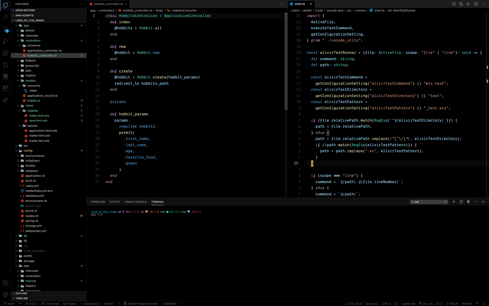
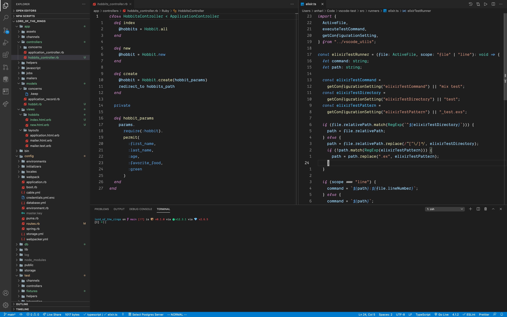

# Darkest+ theme for VS Code

The default Dark+ theme with much darker backgrounds, and some personal preferences thrown in. It's like the High Contrast version of Dark+, without all of the noise.

## _Darkest+ theme_



## _Default Dark+ theme_



## Customize it to your liking

```json
{
  "workbench.colorCustomizations": {
    "[Darkest+]": {
      "panel.background": "#000"
    }
  }
}
```
